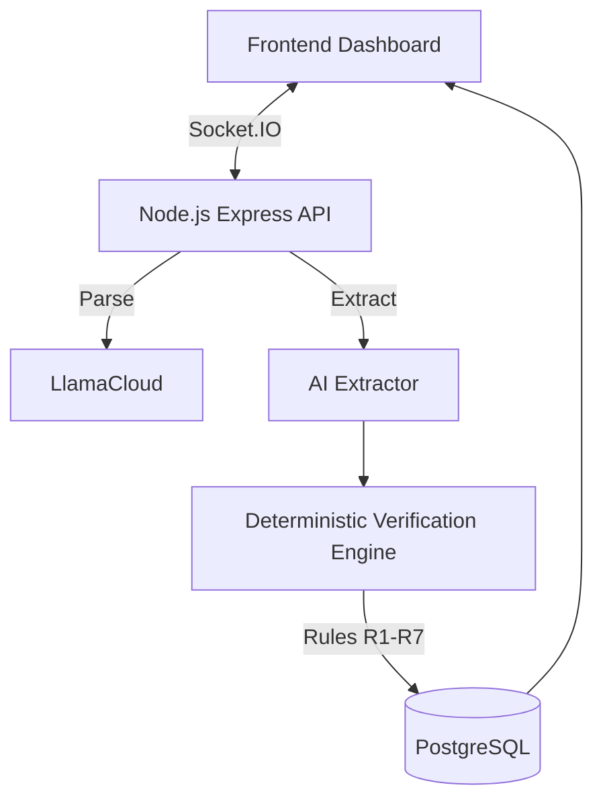

<p align="center">
  
</p>

<h1 align="center">FinVerify</h1>

<p align="center">
  <strong>Deterministic Fundraising Document Cross-Verification & Due Diligence Engine</strong>
</p>

<p align="center">
  
  
  
  

</p>

---

## 📋 Table of Contents

- [Overview](#-overview)
- [Key Features](#-key-features)
- [Architecture](#️-architecture)
- [The Verification Engine](#-the-verification-engine)
- [Tech Stack](#-tech-stack)
- [Project Structure](#-project-structure)
- [Prerequisites](#-prerequisites)
- [Installation & Setup](#️-installation--setup)
- [API Reference](#-api-reference)
- [Database Schema](#-database-schema)
- [Contributing](#-contributing)


---

## 🚀 Overview

**FinVerify** is an intelligent due diligence platform that cross-verifies fundraising documents — such as **Pitch Decks**, **Financial Models**, **Cap Tables**, and **Certified P&L statements** — to detect numerical mismatches, missing data, and math errors.

Unlike generic LLM wrappers that hallucinate or struggle with math, FinVerify uses a **deterministic rule engine** powered by a configurable Rulepack. It extracts data using AI, but the verification, arithmetic, and scoring are 100% deterministic, traceable, and auditable.

### The Problem

Investors and VCs spend days manually cross-referencing numbers between pitch decks and financial spreadsheets. Founders unknowingly submit documents with conflicting claims — a revenue figure in Slide 12 that doesn't match Row 47 in their financial model — leading to lost credibility.

### The Solution

FinVerify automates this entire process:

1. **Upload** your pitch deck and financial model.
2. **AI Extractor** parses each document, extracting financial metrics with exact source quotes.
3. **Deterministic Engine** compares metrics across documents using strict accounting rules.
4. **Readiness Report** is generated with a 5-pillar score and exact evidence for every finding.

---

## ✨ Key Features

| Feature | Description |
|---|---|
| 🔍 **Deterministic Verification** | Hardcoded, unit-tested accounting rules (R1 to R7) that do not hallucinate math. |
| 📊 **5-Pillar Readiness Score** | Evaluates Completeness, Math, Consistency, Plausibility, and Cap Table. |
| 📑 **Traceable Evidence** | Every discrepancy cites the exact document, page number, and quote. |
| ✖️ **Multiplication Factor Scoring** | Severity is dynamically calculated (`base × materiality × direction × confidence × corroboration`). |
| ⚖️ **Adjudication System** | Override findings by declaring a source authoritative, or accepting an explanation. |
| ⚡ **Real-Time Pipeline** | Socket.IO-powered live progress updates from upload to report generation. |
| 📥 **Export Ready** | Export the complete audit trail and matrix as PDF or CSV. |

---

## 🏗️ Architecture



---

## ⚙️ The Verification Engine

The core of FinVerify is the engine (`server/engine/`), which applies a set of strict rules against the extracted observations:

- **R1 (Cross-Source Conflict):** Same metric, different documents, different numbers.
- **R2 (Accounting Identities):** Gross Profit = Revenue - COGS. If it doesn't add up, it's flagged.
- **R3 (Roll-up Guards):** 12 months must equal the annual total.
- **R4 (Projections):** Flags wild, unsupported growth jumps.
- **R5 (Unsupported Claims):** Claims in the pitch deck without backing in the financials.
- **R6 (Plausibility):** Flags impossible metrics (e.g. Gross Margin > 100%).
- **R7 (Cap Table):** Verifies the cap table sums to 100% and checks ESOP mathematics.

---

## 🛠 Tech Stack

### Backend
- **Node.js** + **Express** for the REST API
- **Socket.IO** for real-time pipeline tracking
- **PostgreSQL** (`pg`) for relational persistence
- **JWT** for session-based anonymous authentication

### Frontend
- **Vanilla HTML5 / CSS3 / JS** — Zero-build-step, blazing fast
- **CSS Variables & Custom Properties** for consistent design systems
- **Marked.js** for markdown rendering

---

## 📁 Project Structure

```
FinVerify/
├── .env.example               # Environment template
├── README.md                  # Project documentation
├── Frontend/                  # Vanilla JS Client
│   ├── css/
│   │   ├── components/        # findings.css, card.css, etc.
│   │   ├── pages/             # dashboard.css, history.css, upload.css
│   │   └── style.css          # Global tokens
│   ├── js/
│   │   ├── api.js             # API client with JWT interception
│   │   ├── dashboard.js       # Core dashboard rendering logic
│   │   ├── dashboard-helpers.js # UI formatting helpers
│   │   ├── socket.js          # Real-time connection class
│   │   └── history.js         # History page logic
│   └── index.html, analysis.html, history.html, upload.html
│
└── server/                    # Node.js Backend
    ├── engine/                # Deterministic rule engine
    │   ├── rules/             # R1 through R7 implementations
    │   ├── core/              # Scoring and severity math
    │   └── rulepack.json      # Configurable tolerances and weights
    ├── db/                    # PostgreSQL migrations & queries
    ├── routes/                # Express API endpoints
    └── index.js               # Server entry point
```

---

## 📝 Prerequisites

- **Node.js** v18+
- **PostgreSQL** v15+
- API keys for extraction services (Groq/LlamaCloud/Gemini depending on environment config)

---

## ⚙️ Installation & Setup

1. **Clone & Install**
   ```bash
   git clone https://github.com/krish-tarpara/TETRA022.git
   cd TETRA022/server
   npm install
   ```

2. **Environment Setup**
   ```bash
   cp .env.example .env
   # Edit .env with your DATABASE_URL and API keys
   ```

3. **Database Migration**
   ```bash
   npm run migrate
   ```

4. **Start the Server**
   ```bash
   npm run dev
   ```
   The backend will start on `http://localhost:5000` and statically serve the frontend.

5. **Run Tests (Optional but recommended)**
   ```bash
   npm test          # Runs all 206 deterministic engine unit tests
   npm run test:e2e  # Runs full pipeline integration tests
   ```

---

## 📡 API Reference

| Endpoint | Method | Description |
|---|---|---|
| `/api/v1/auth/session` | `POST` | Generate anonymous JWT token |
| `/api/v1/analyze` | `POST` | Upload documents and trigger pipeline |
| `/api/v1/sessions/:id` | `GET` | Retrieve full analysis report |
| `/api/v1/sessions/:id/adjudicate` | `POST` | Override finding (authoritative source/waive) |
| `/api/v1/sessions/:id/export/pdf` | `GET` | Export report as PDF |
| `/api/v1/sessions/:id/export/csv` | `GET` | Export findings as CSV |

---

## 🗃 Database Schema

FinVerify uses a normalized PostgreSQL schema designed for auditability:

- `users` — Anonymous user profiles (via JWT)
- `analysis_sessions` — Top-level report container (score, pillars, engine metadata)
- `documents` — Metadata about uploaded files
- `findings` — Individual deterministic rule violations (Severity, Evidence, Computation)
- `adjudications` — Audit trail of user overrides

---

## 🤝 Contributing

1. **Fork** the repository
2. **Create** a feature branch (`git checkout -b feature/amazing-feature`)
3. **Commit** your changes (`git commit -m "feat: add amazing feature"`)
4. **Push** to the branch (`git push origin feature/amazing-feature`)
5. **Open a Pull Request**


<p align="center">
  <sub>Built with ❤️ for deterministic finance verification.</sub>
</p>
