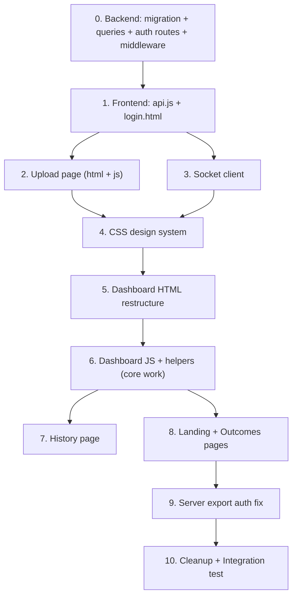

# FinVerify — Frontend ↔ Backend Integration Plan (v3 — Audited)

Connect the separately-built frontend and backend into a working product. The backend's deterministic engine is **done and tested** (206 unit tests, 62 e2e tests). The frontend was built against the old AI-driven pipeline. This plan rewires the frontend to speak the new engine's language.

---

## Decisions Resolved

| Question | Decision |
|---|---|
| Branding | **FinVerify** everywhere (replacing "ReadyAI") |
| Login page | **Keep** — add email/password auth to backend. Users log in to access history. |
| Vite dev workflow | **Remove** — use backend static serving at `localhost:5000` |
| outcomes.html | **Update** to match new 5-pillar vocabulary |
| moneyShower.js | **Delete** — not integrated |

---

## Audit Results — Bugs Found

> [!CAUTION]
> **7 bugs** were found during the audit that would cause runtime failures if the plan were executed as-is. All are now fixed in the plan below. Each bug is marked with 🐛 where it was found.

### Bug #1: Auth middleware will reject login-based users (CRITICAL)

**Root cause:** The current [verifyToken middleware](file:///g:/TetraTHON/front+back/Tetrathon (3) (1)/Tetrathon/server/middleware/auth.js) does this:
```js
const decoded = jwt.verify(token, JWT_SECRET);     // decoded.userId = random UUID (not DB id!)
const user = await db.getUserByToken(token);         // looks up by full JWT string in session_token column
req.user = { ...decoded, userId: user.id };          // overrides JWT userId with real DB id
```

For **anonymous sessions**, this works because `POST /auth/session` stores the full JWT string in `users.session_token`. But for **login-based users**, the JWT is signed with `{ userId: user.id }` and never stored in `session_token`. So `getUserByToken(token)` returns `null` → **401 on every request**.

**Fix:** Add a `getUserById(id)` query. Update middleware to: decode JWT → try `getUserById(decoded.userId)` → if found, use it; else fall back to `getUserByToken(token)` for backward compatibility with anonymous sessions.

---

### Bug #2: `session_token` NOT NULL constraint blocks login user creation

**Root cause:** The [users table](file:///g:/TetraTHON/front+back/Tetrathon (3) (1)/Tetrathon/server/db/schema.sql#L1-L7) has:
```sql
session_token VARCHAR(500) UNIQUE NOT NULL
```

A user created via `POST /auth/register` with email+password won't have a `session_token` at creation time. The `NOT NULL` constraint will reject the INSERT.

**Fix:** The migration must drop the NOT NULL constraint:
```sql
ALTER TABLE users ALTER COLUMN session_token DROP NOT NULL;
```

---

### Bug #3: Landing page and outcomes page are behind auth wall

**Root cause:** Both [index.html](file:///g:/TetraTHON/front+back/Tetrathon (3) (1)/Tetrathon/Frontend/index.html#L219) and [outcomes.html](file:///g:/TetraTHON/front+back/Tetrathon (3) (1)/Tetrathon/Frontend/outcomes.html#L170) load `<script src="js/api.js">`, which calls `requireAuth()` immediately on load (line 18). If no token exists, it redirects to `login.html`. This means **a first-time visitor cannot even see the landing page** — they're bounced straight to login.

**Fix:** Make `requireAuth()` aware of public pages. The landing page (`index.html`) and outcomes page (`outcomes.html`) must be accessible without a token. The function should skip the redirect for these pages. Auth-required pages: `upload.html`, `analysis.html`, `history.html`.

---

### Bug #4: Document categories mismatch — engine won't recognise old frontend values

**Root cause:** The frontend [upload.js](file:///g:/TetraTHON/front+back/Tetrathon (3) (1)/Tetrathon/Frontend/js/upload.js#L18-L24) sends these category values:
```js
'pitch_deck', 'financial_model', 'cap_table', 'certified_pnl', 'unknown'
```

But the backend engine's [rulepack.json authority_tiers](file:///g:/TetraTHON/front+back/Tetrathon (3) (1)/Tetrathon/server/engine/rulepack.json#L135-L148) and [docTypeClassifier.js](file:///g:/TetraTHON/front+back/Tetrathon (3) (1)/Tetrathon/server/services/parser/docTypeClassifier.js) only recognise:
```
pitch_deck, financial_statements, mis, projections, cap_table,
auditor_notes, term_sheet, kpi_dashboard, unknown
```

If a user selects "Financial Model" or "Certified P&L" from the dropdown, the backend stores a category string that the engine treats as `unknown` tier. This silently degrades the severity scoring — the engine can't tell which document is more authoritative.

**Fix:** Replace `financial_model` with `financial_statements` and `certified_pnl` with `financial_statements`. Add the other 4 missing types (`mis`, `projections`, `auditor_notes`, `term_sheet`, `kpi_dashboard`).

---

### Bug #5: Export URLs hardcoded to `http://localhost:5000`

**Root cause:** [dashboard.js](file:///g:/TetraTHON/front+back/Tetrathon (3) (1)/Tetrathon/Frontend/js/dashboard.js#L213-L218) uses:
```js
window.open(`http://localhost:5000/api/v1/sessions/${sessionId}/export/pdf`, '_blank');
```

Since the frontend is served from the same origin (port 5000), this works in development but would break in any other deployment. It also doesn't include the auth token, so the export will fail with 401.

**Fix:** Use relative URLs (`/api/v1/sessions/...`) and append the token as a query parameter (since `window.open` can't set headers), OR fetch the export as a blob with auth headers and trigger a download.

---

### Bug #6: Upload socket race condition

**Root cause:** [upload.js](file:///g:/TetraTHON/front+back/Tetrathon (3) (1)/Tetrathon/Frontend/js/upload.js#L177-L183) creates a socket connection, waits for `connect`, emits `analysis:start`, then immediately does `window.location.href = analysis.html`. The page redirect severs the socket before the server can process the room join. Meanwhile, the backend's `setImmediate(() => reportBuilder.runPipeline(...))` already started — so status events may fire to an empty room.

This isn't fatal (the dashboard reconnects via `rejoin`), but it's a wasted connection and risks missing early progress events.

**Fix:** Remove the socket connection from upload.js entirely. Just redirect after POST. The `analysis:start` event only joins a room — and the backend already starts processing via `setImmediate` regardless. The dashboard page's `rejoin` event handles room joining.

---

### Bug #7: Missing `getUserById` query function

**Root cause:** The [queries.js](file:///g:/TetraTHON/front+back/Tetrathon (3) (1)/Tetrathon/server/db/queries.js) exports `getUserByToken(token)` but has no `getUserById(id)` function. The updated middleware (Bug #1 fix) needs this to look up login-based users by their DB id from the JWT claim.

**Fix:** Add `getUserById(id)` query and export it.

---

## Proposed Changes

### Component 0: Backend — Login/Register System + Bug Fixes

#### [NEW] [server/db/migrations/003_user_auth.sql](file:///g:/TetraTHON/front+back/Tetrathon (3) (1)/Tetrathon/server/db/migrations/003_user_auth.sql)

🐛 **Fixes Bug #2** — drops NOT NULL on session_token, adds email/password columns:
```sql
-- Allow login users who don't have session tokens
ALTER TABLE users ALTER COLUMN session_token DROP NOT NULL;

-- Login support
ALTER TABLE users ADD COLUMN IF NOT EXISTS email VARCHAR(255) UNIQUE;
ALTER TABLE users ADD COLUMN IF NOT EXISTS password_hash VARCHAR(255);
ALTER TABLE users ADD COLUMN IF NOT EXISTS display_name VARCHAR(100);
CREATE UNIQUE INDEX IF NOT EXISTS idx_users_email ON users(email);
```

#### [MODIFY] [server/db/queries.js](file:///g:/TetraTHON/front+back/Tetrathon (3) (1)/Tetrathon/server/db/queries.js)

🐛 **Fixes Bug #7** — add three new query functions:
- `getUserById(id)` — `SELECT * FROM users WHERE id = $1`
- `createUserWithEmail(email, passwordHash, displayName)` — insert user with email + bcrypt hash
- `getUserByEmail(email)` — look up user by email for login

Export all three.

#### [MODIFY] [server/middleware/auth.js](file:///g:/TetraTHON/front+back/Tetrathon (3) (1)/Tetrathon/server/middleware/auth.js)

🐛 **Fixes Bug #1** — dual-path user lookup:
```js
const decoded = jwt.verify(token, process.env.JWT_SECRET);

// Try ID-based lookup first (login users have their real DB id in the JWT)
let user = await db.getUserById(decoded.userId);

// Fall back to token-based lookup (anonymous sessions store the full JWT in session_token)
if (!user) {
  user = await db.getUserByToken(token);
}

if (!user) {
  return res.status(401).json({ error: 'Invalid session' });
}

req.user = { ...decoded, userId: user.id };
```

This preserves backward compatibility: existing anonymous sessions (where JWT userId ≠ DB id) fall through to token lookup. New login sessions (where JWT userId = DB id) match on the first try.

#### [MODIFY] [server/routes/auth.js](file:///g:/TetraTHON/front+back/Tetrathon (3) (1)/Tetrathon/server/routes/auth.js)

Add two new endpoints alongside the existing `POST /session`:

- **`POST /auth/register`** — accepts `{email, password, name}`, validates, hashes password with bcrypt, creates user via `createUserWithEmail`, signs JWT with `{ userId: user.id }` (the real DB id), returns `{ token }`
- **`POST /auth/login`** — accepts `{email, password}`, calls `getUserByEmail`, verifies password with bcrypt, signs JWT with `{ userId: user.id }`, returns `{ token }`

The existing `POST /auth/session` (anonymous) is left untouched.

#### [MODIFY] [package.json](file:///g:/TetraTHON/front+back/Tetrathon (3) (1)/Tetrathon/package.json)

Add `bcryptjs` dependency for password hashing.

---

### Component 1: Frontend Auth — API Client + Login Page

#### [MODIFY] [api.js](file:///g:/TetraTHON/front+back/Tetrathon (3) (1)/Tetrathon/Frontend/js/api.js)

🐛 **Fixes Bug #3** — public page awareness:
```js
const PUBLIC_PAGES = ['index.html', 'outcomes.html', 'login.html', ''];

const requireAuth = () => {
  const token = localStorage.getItem('finverify_token');
  const path = window.location.pathname;
  const page = path.split('/').pop();
  const isPublicPage = PUBLIC_PAGES.includes(page);
  const isLoginPage = page === 'login.html';

  if (!token && !isPublicPage) {
    window.location.href = 'login.html';
  } else if (token && isLoginPage) {
    window.location.href = 'index.html';
  }
  return token;
};
```

Other changes:
- Change `API_URL` from `'http://localhost:5000/api/v1'` to `'/api/v1'` (same-origin relative)
- Keep `isLogin` check for `/auth/login` and `/auth/register`
- Keep `api.logout()` that clears token and redirects to `login.html`

#### [MODIFY] [login.html](file:///g:/TetraTHON/front+back/Tetrathon (3) (1)/Tetrathon/Frontend/login.html)

Keep page, make it work:
- Login form calls `POST /auth/login` (will now exist)
- Wire up "Create one here" to toggle to a registration form (`POST /auth/register` with email, password, name)
- On success, store token in `localStorage`, redirect to `index.html`
- Update branding "ReadyAI" → "FinVerify"

---

### Component 2: Upload Page

#### [MODIFY] [upload.html](file:///g:/TetraTHON/front+back/Tetrathon (3) (1)/Tetrathon/Frontend/upload.html)

- Add collapsible **Exchange Rate section** below file list
- Add note: *"We'll show this rate on any finding that depends on it."*
- Update nav bar branding

#### [MODIFY] [upload.js](file:///g:/TetraTHON/front+back/Tetrathon (3) (1)/Tetrathon/Frontend/js/upload.js)

🐛 **Fixes Bug #4** — correct document types:
```js
const DOCUMENT_TYPES = [
  { value: 'pitch_deck', label: 'Pitch Deck' },
  { value: 'financial_statements', label: 'Financial Statements' },
  { value: 'mis', label: 'MIS Report' },
  { value: 'projections', label: 'Projections' },
  { value: 'cap_table', label: 'Cap Table' },
  { value: 'auditor_notes', label: 'Auditor Notes' },
  { value: 'term_sheet', label: 'Term Sheet' },
  { value: 'kpi_dashboard', label: 'KPI Dashboard' },
  { value: 'unknown', label: 'Auto-detect' }
];
```

🐛 **Fixes Bug #6** — remove socket race condition:
```js
// BEFORE (broken):
const socket = io('http://localhost:5000/analysis', { auth: { token } });
socket.on('connect', () => {
  socket.emit('analysis:start', { sessionId });
  window.location.href = `analysis.html?sessionId=${sessionId}`;
});

// AFTER (fixed):
localStorage.setItem('currentSessionId', sessionId);
window.location.href = `analysis.html?sessionId=${sessionId}`;
```

Other changes:
- Collect FX rates from new inputs, send as `fxRates` JSON string in FormData
- Keep file validation (2+ files, 2+ categories)

---

### Component 3: Socket Client

#### [MODIFY] [socket.js](file:///g:/TetraTHON/front+back/Tetrathon (3) (1)/Tetrathon/Frontend/js/socket.js)

- Use relative URL `'/analysis'` instead of `'http://localhost:5000/analysis'`
- Add `report:updated` event handler (AI narration arrives post-analysis)
- Improve reconnection: on reconnect, emit `rejoin` with stored sessionId

---

### Component 4: CSS Design System

#### [MODIFY] [style.css](file:///g:/TetraTHON/front+back/Tetrathon (3) (1)/Tetrathon/Frontend/css/style.css)

Add CSS custom properties for classifications and severity bands:
```css
--color-verified-mismatch: #dc2626;
--color-unresolved: #d97706;
--color-missing-info: #6366f1;
--color-unusual-assumption: #9333ea;
--color-verified-consistent: #16a34a;
--color-critical: #dc2626;
--color-high: #ea580c;
--color-medium: #d97706;
--color-minor: #65a30d;
```

#### [MODIFY] [dashboard.css](file:///g:/TetraTHON/front+back/Tetrathon (3) (1)/Tetrathon/Frontend/css/pages/dashboard.css)

Major additions for new UI sections: pillar bars, finding cards, computation box, evidence grid, classification/severity badges, factors chain, verified section, follow-up list, AI notes panel, ceiling marker, FX chip, filter bar, redesigned modal.

#### [NEW] [findings.css](file:///g:/TetraTHON/front+back/Tetrathon (3) (1)/Tetrathon/Frontend/css/components/findings.css)

Dedicated styles for finding cards and evidence display.

---

### Component 5: Dashboard HTML

#### [MODIFY] [analysis.html](file:///g:/TetraTHON/front+back/Tetrathon (3) (1)/Tetrathon/Frontend/analysis.html)

Complete restructure of main content. New sections:

- **A — Score Hero**: Large score + band label + ceiling marker
- **B — Pillar Breakdown** (NEW): 5 horizontal bars with scores, weights, finding counts; clickable to filter findings; `applicable: false` greyed out with "Not assessed"
- **C — Classification Counts** (NEW): 5 count badges with classification-specific colours
- **D — Comparison Matrix**: Dynamic from findings data (replaces hardcoded HTML)
- **E — Findings List**: Cards with prominent `computation.substituted`, filter controls (classification, severity, pillar). Each card shows: `ref_code`, classification badge (visually distinct between VERIFIED_MISMATCH and UNRESOLVED_INCONSISTENCY), severity band + score number, metric_label + formatted period, computation box (monospace), narrative or fallback, evidence filenames+pages, fx_applied chip, likely_culprit note, collapsible factors chain
- **F — Verified Consistent** (NEW): Separate positive green section
- **G — Follow-up Questions** (NEW): Consolidated list with copy-all button
- **AI Notes Tab** (NEW): Separate panel with disclaimer *"Generative analysis. Not part of the score. Not verified."*
- **Modal**: Redesigned for variable-length evidence (scrollable evidence cards, not fixed 2-pane)

Update nav bar and branding.

---

### Component 6: Dashboard JS (core work)

#### [NEW] [dashboard-helpers.js](file:///g:/TetraTHON/front+back/Tetrathon (3) (1)/Tetrathon/Frontend/js/dashboard-helpers.js)

Utility functions:
- `formatPeriodKey(key)` — `FY2025-26` stays, `M03-FY2024-25` → "March 2025", `Q3-FY2024-25` → "Q3 FY2024-25", `REL-Y1` → "Year 1 (projected)", `UNKNOWN` → "Period not stated"
- `formatIndianNumber(num)` — `52000000` → `Rs 5,20,00,000`
- `getClassificationColor(classification)` / `getClassificationLabel(classification)` — maps 5 types to colours + human labels
- `getSeverityColor(band)` — maps 4 bands to colours
- `renderEvidenceCard(evidence)` — reusable card for one evidence entry
- `renderFactorsChain(factors, severityScore)` — multiplication chain ending in score
- `renderDirectionExplanation(directionFactor)` — `1.25` → "Error makes company look better (weighted higher)", `0.85` → "Company understated (weighted lower)"

#### [MODIFY] [dashboard.js](file:///g:/TetraTHON/front+back/Tetrathon (3) (1)/Tetrathon/Frontend/js/dashboard.js)

**Complete rewrite.** Dual-schema handling:

```js
if (data.schema === 'engine') {
  renderEngineReport(data);  // New pipeline
} else {
  renderLegacyReport(data);  // Old sessions still viewable
}
```

🐛 **Fixes Bug #5** — export with auth:
```js
// BEFORE: window.open(`http://localhost:5000/api/v1/sessions/${sessionId}/export/pdf`);
// AFTER:
window.exportPdf = () => {
  const token = localStorage.getItem('finverify_token');
  window.open(`/api/v1/sessions/${sessionId}/export/pdf?token=${token}`, '_blank');
};
```

> [!NOTE]
> This requires a small backend change to `verifyToken` middleware: accept token from query parameter as fallback when Authorization header is absent. Only for export routes, to support `window.open()`.

New render functions for all 7 dashboard sections + modal + filters. Legacy fallback preserves current rendering for old sessions.

---

### Component 7: History Page

#### [MODIFY] [history.js](file:///g:/TetraTHON/front+back/Tetrathon (3) (1)/Tetrathon/Frontend/js/history.js)

- Use `session.band` and `session.label` for band-specific colours and text
- Show band label instead of just "X mismatches found"
- Handle both engine and legacy sessions

#### [MODIFY] [history.html](file:///g:/TetraTHON/front+back/Tetrathon (3) (1)/Tetrathon/Frontend/history.html)

- Update nav bar and branding

---

### Component 8: Landing Page & Outcomes

#### [MODIFY] [index.html](file:///g:/TetraTHON/front+back/Tetrathon (3) (1)/Tetrathon/Frontend/index.html)

- Rebrand "ReadyAI" → "FinVerify"
- Update nav bar — show Login/Register for unauthenticated users, Upload/History/Logout for authenticated
- Update feature descriptions to match new engine (5 pillars, arithmetic proof)
- Update hero copy

#### [MODIFY] [outcomes.html](file:///g:/TetraTHON/front+back/Tetrathon (3) (1)/Tetrathon/Frontend/outcomes.html)

Update from "4 core audit outcomes" to **5 pillars**:

| Old Card | New Card |
|---|---|
| Cross-Document Verification | **Cross-Document Consistency** (30%) — Do the documents agree with each other? |
| Discrepancy Identification | **Arithmetic Integrity** (25%) — Does the maths inside the documents work? |
| Readiness Reporting | **Evidence Coverage** (20%) — Are claims backed by evidence? |
| Classification Intelligence | **Projection Credibility** (15%) — Are forecasts believable? |
| *(none)* | **Ownership Integrity** (10%) — Does the cap table add up? |

Update branding and nav bar.

#### [DELETE] [moneyShower.js](file:///g:/TetraTHON/front+back/Tetrathon (3) (1)/Tetrathon/Frontend/js/moneyShower.js)

Delete — not used.

---

### Component 9: Server Export Auth Fix

#### [MODIFY] [server/middleware/auth.js](file:///g:/TetraTHON/front+back/Tetrathon (3) (1)/Tetrathon/server/middleware/auth.js)

🐛 **Fixes Bug #5** — accept token from query parameter for export routes:
```js
// At the top of verifyToken:
let token = null;
if (authHeader && authHeader.startsWith('Bearer ')) {
  token = authHeader.split(' ')[1];
} else if (req.query.token) {
  token = req.query.token;  // fallback for window.open export links
}
```

---

### Component 10: Cleanup

#### [DELETE or IGNORE] vite.config.js and postcss.config.js

Dead code. Delete to avoid confusion.

---

## Execution Order



| Phase | Files | Effort |
|---|---|---|
| 0. Backend auth + bug fixes | `003_user_auth.sql`, `queries.js`, `auth.js` (route + middleware), `package.json` | Medium |
| 1. Frontend auth | `api.js`, `login.html` | Small |
| 2. Upload page | `upload.html`, `upload.js` | Medium |
| 3. Socket client | `socket.js` | Small |
| 4. CSS design system | `style.css`, `dashboard.css`, new `findings.css` | Medium |
| 5. Dashboard HTML | `analysis.html` | Large |
| 6. Dashboard JS | `dashboard.js`, new `dashboard-helpers.js` | **Large** |
| 7. History page | `history.html`, `history.js` | Small |
| 8. Landing + Outcomes | `index.html`, `outcomes.html` | Medium |
| 9. Server export fix | `auth.js` middleware | Small |
| 10. Cleanup + test | Delete files, run tests | Medium |

---

## Verification Plan

### Automated Tests
```bash
npm test          # 206 engine unit tests (no changes to engine)
npm run test:e2e  # 62 e2e tests (verify auth changes don't break)
```

### Manual Verification
1. **Register + Login**: Create account → login → verify token stored → verify history accessible
2. **Landing page without auth**: Open `localhost:5000` in incognito → verify landing page loads without redirect to login
3. **Auth redirect**: Click "Upload" without being logged in → verify redirect to login
4. **Upload flow**: Upload 3 sample docs → verify FX rate input → submit → verify redirect to dashboard
5. **Processing overlay**: Verify websocket progress during analysis (no missed events)
6. **Dashboard**: Score hero, 5 pillar bars, finding cards with `computation.substituted`, evidence display, verified consistent section, follow-up questions, AI notes
7. **Finding modal**: Click finding → verify all evidence entries shown (not just 2), factors chain, copy button
8. **Export**: PDF and CSV export buttons work (auth token passed correctly)
9. **History page**: Past sessions with band labels and colours; both old and new sessions render
10. **Outcomes page**: Updated to 5-pillar vocabulary, accessible without login
11. **Edge cases**: `applicable: false` pillar greyed out, `ceiling_applied` shown, null narrative falls back to expression, single-evidence finding renders correctly
